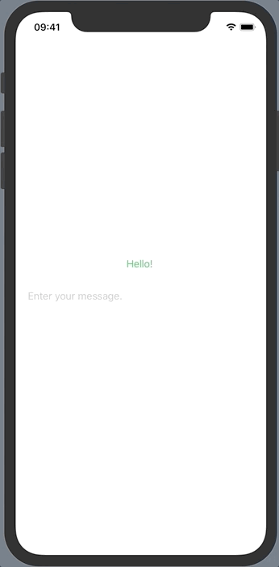
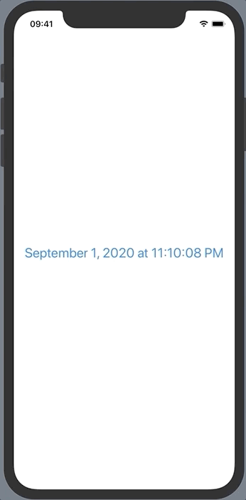
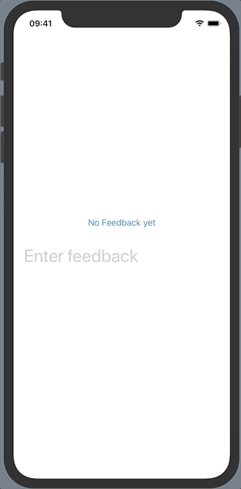
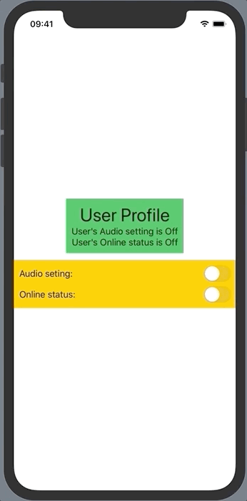

# SwiftUI Basics

## In this repo you will find following key concepts which are very necessory to start creating SwiftUI Apps: 
- You can check sample with Common use of Text, Image and List.
- Navigation 
- Custom grid (Conventional alike CollectionView) with help of List and for each. 
- Grid view sample with State property implementation for changing column count at runtime
- Two way binding for State property.
- ObservaleObject, Publish, ObservedObject implementation
- EnvironmentObject example.

## Demo:

<table>
<tr> <td> Sample for Navigation and State binding: <td> </tr>
<tr>
    <td> </td>
    <td> </td>
</tr> 
<tr><td> Sample for Observable Object and it's binding:</td></tr>
<tr>
      <td> </td>
      <td> </td>
</tr> 
<tr><td> Sample for creating custom CollectionView and Environment Object:</td></tr>
<tr>
      <td> </td>
      <td> </td>
</tr> 
</table>
